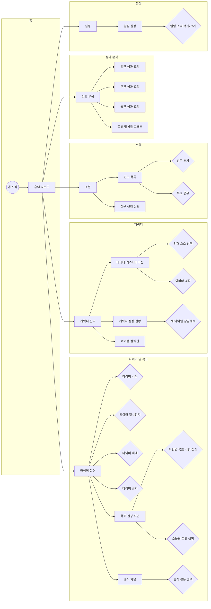

```mermaid
flowchart LR

  subgraph s1 ["홈"]
    n1(("앱 시작"))
    n2["홈/대시보드"]
  end

  subgraph s2 ["타이머 및 목표"]
    n3["타이머 화면"]
    n4{"타이머 시작"}
    n5{"타이머 일시정지"}
    n6{"타이머 재개"}
    n7{"타이머 정지"}
    n8["목표 설정 화면"]
    n9{"작업별 목표 시간 설정"}
    n10{"오늘의 목표 설정"}
    n11["휴식 화면"]
    n12{"휴식 활동 선택"}
  end

  subgraph s3 ["캐릭터"]
    n13["캐릭터 관리"]
    n14["아바타 커스터마이징"]
    n15{"외형 요소 선택"}
    n16{"아바타 저장"}
    n17["캐릭터 성장 현황"]
    n18{"새 아이템 잠금해제"}
    n19["아이템 컬렉션"]
  end

  subgraph s4 ["성과 분석"]
    n20["성과 분석"]
    n21["일간 성과 요약"]
    n22["주간 성과 요약"]
    n23["월간 성과 요약"]
    n24["목표 달성률 그래프"]
  end

  subgraph s5 ["소셜"]
    n25["소셜"]
    n26["친구 목록"]
    n27{"친구 추가"}
    n28{"목표 공유"}
    n29["친구 진행 상황"]
  end

  subgraph s6 ["설정"]
    n30["설정"]
    n31["알림 설정"]
    n32{"알림 소리 켜기/끄기"}
  end

  n1 --> n2
  n2 --> n3
  n2 --> n13
  n2 --> n20
  n2 --> n25
  n2 --> n30
  n3 --> n4
  n3 --> n5
  n3 --> n6
  n3 --> n7
  n3 --> n8
  n3 --> n11
  n8 --> n9
  n8 --> n10
  n11 --> n12
  n13 --> n14
  n13 --> n17
  n13 --> n19
  n14 --> n15
  n14 --> n16
  n17 --> n18
  n20 --> n21
  n20 --> n22
  n20 --> n23
  n20 --> n24
  n25 --> n26
  n25 --> n29
  n26 --> n27
  n26 --> n28
  n30 --> n31
  n31 --> n32
```
